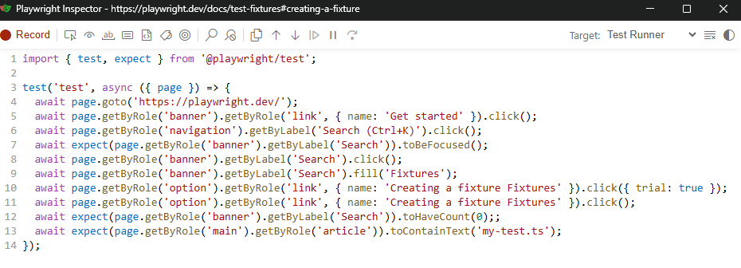

# Overview

This project is a fork of the [Playwright](https://playwright.dev/) test tool.

**Original Project**: [Microsoft Playwright](https://github.com/microsoft/playwright)  

The aim is to tweak the codegen tool from a great learning instrument into a useable tool for day to day usage. 



# License
This project maintains the same Apache 2.0 license as the original Microsoft Playwright project. See LICENSE for details.

## Acknowledgments
All the hard work is done by the [Playwright](https://github.com/microsoft/playwright) team at Microsoft. We're grateful for their open-source contribution to the testing community.


# Changes

## 🔗 Chained locators
The recorder will prefer chaining locators together to identify a particular element within a section of the page. Avoid collisions with other similar named elements when dealing with multiple menus or grids

``` typescript 
await page
.getByRole('main')
.getByRole('article')
.getByRole('link', { name: 'How to install Playwright' })
.click();

```


## 🔍⚠️ Waiting until element is removed
Generate a command to wait for an element removal from the DOM. 

Wait for spinners, modals, or other dynamic elements to disappear

``` typescript 
await expect(page.getByRole('dialog')).toHaveCount(0);
```


## 🔍👆  Waiting until element is clickable
Generate a command that waits for an element to be clickable before proceeding.

Waits for playwright's [actionability checks](https://playwright.dev/docs/actionability) to pass for an element click before proceeding. 

Note: Use when the element receiving the trial click differs from the element receiving the next actual click (or check or fill) as these will receive the same actionability checks.

``` typescript 
await page.getByRole('main').getByRole('article').click({ trial: true });
```


##  🎯 Waiting for element focus
Generate a command that ensures the element is now focused upon.

``` typescript 
await expect(page.getByRole('dialog')).toBeFocused();
```


##  🏷️ Waiting for element attribute
Generate a command that ensures elements has the expected classes, states, or properties

``` typescript 
await expect(page
    .getByRole("group", { name: "Related" })
    .getByRole("menuitem"))
    .toHaveAttribute('class', 'content');
```

 ##  ✏️ Editable text grid
The generated code is editable.  Buttons in the tool bar allow for the order of the commands to be rearranged. 

When using `Poll until removed` it is necessary to select the element while it remains in the DOM.  The action to remove it is then generated after and placed on the line below.   When all steps are recorded, the action command can be moved before the poll command in the flow. 


# Getting Started
Install the package from npm

`npm install chained-codegen`

Then install the playwright browser binaries (e.g. for Chrome)

`npm chained codegen install chrome`

Finally, start the recorder 

`npm chained-codegen start` 


